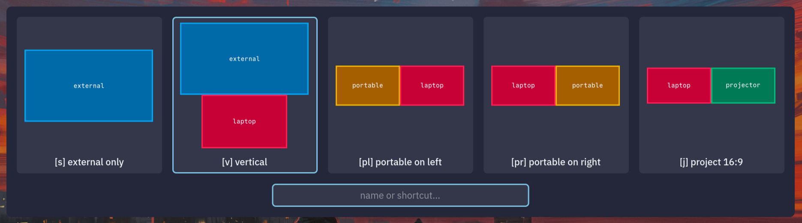

# nirilayout

nirilayout is a simple tool to quickly switch your
[niri](https://github.com/YaLTeR/niri) output configuration between different
layouts. Especially useful for laptop users who move between different setups
frequently.



## Usage

### Install nirilayout

Install Go 1.25+ and GTK 4.16+, clone this repo, then run `go install` to
install nirilayout to $GOBIN. Alternatively, run `make` to build nirilayout in
the current directory.

### Configure layouts

_(I'll assume you're using the default config directory `~/.config/niri`. If your
configuration is elsewhere, pass the `-c` flag to nirilayout each time you run
it.)_

In your `~/.config/niri`, create layouts for your different setups in files
named `layout_<name>.kdl`. This file contains your niri configuration as usual
but with some special nirilayout-specific comments at the top, beginning with
`//!`. (These comments are just KDL v2, by the way).

- `name`: The name of the layout. Wrap in quotes if it contains spaces.
- `shortcut`: The shortcut(s) to use for this layout. You can specify multiple
  shortcuts by separating them with spaces.
- `display <name>[:color] x=<x> y=<y> w=<w> h=<h>`: Specifies a display in this
  layout. width and height are in logical pixels, not physical pixels. If your
  monitor is scaled, divide the physical size by the scale factor to get the
  logical size. Repeat this for each display.

  nirilayout will pick a color for each display based on its name. If you want
  to specify a color yourself, append `:N` to the name, where `N` is a number
  between 0 and 17. 0 is gray and 1-17 are the first 17 colors of the [Tailwind CSS
  color palette](https://tailwindcss.com/docs/colors).

  | Index | Color  |     | Index | Color   |     | Index | Color   |
  | ----- | ------ | --- | ----- | ------- | --- | ----- | ------- |
  | 0     | gray   |     | 6     | green   |     | 12    | indigo  |
  | 1     | red    |     | 7     | emerald |     | 13    | violet  |
  | 2     | orange |     | 8     | teal    |     | 14    | purple  |
  | 3     | amber  |     | 9     | cyan    |     | 15    | fuchsia |
  | 4     | yellow |     | 10    | sky     |     | 16    | pink    |
  | 5     | lime   |     | 11    | blue    |     | 17    | rose    |

For example, `layout_vertical.kdl` might look like this:

```kdl
//! name Vertical
//! shortcut v
//! display external x=0 y=0 w=2560 h=1440
//! display laptop:9 x=427 y=1440 w=1706 h=1066

output "Lenovo Group Limited E27q-20 V5HDD696" {
    mode "2560x1440@74.780"
    scale 1
    position x=0 y=0
}

output "BOE 0x0AC1 Unknown" {
    mode "2560x1600@120.001" // logical size: 1706x1066
    scale 1.5
    position x=427 y=1440
}
```

## Configure niri

Now, run `nirilayout` once to select an initial layout. This creates
`~/.config/niri/nirilayout.kdl`, a symlink to the layout you selected.

Finally, remove any ouput configuration in `~/.config/niri/config.kdl` and add
an include to load `nirilayout.kdl`.

```kdl
// config.kdl
// ...
include "nirilayout.kdl"
// ...
```

All done!

## Use nirilayout

Run `nirilayout` again to switch between your layouts. You can bind a shortcut
to `nirilayout` in your `~/.config/niri/config.kdl` to make it easier to switch.

In the switcher, you can select a layout with `←`/`→`/`Return` or the mouse. You
can also type the name of a layout or its shortcut to select it. Shortcuts and
names are case-sensitive.

As soon as you finish typing a name/shortcut, the switcher will immediately
change to the selected layout; no need to press return/enter. Note that this
means that shortcuts cannot be prefixes of other shortcuts (e.g. if you have
both "a" and "ab" as shortcuts, typing "a" will immediately select the first
layout and you won't be able to type "ab").

Layouts are presented in lexicographical order by name. If you want to change
the order, you can rename the files in the config directory.

# Contributing

Contributions are welcome! If you find a bug or have a feature request, please
open an issue or a pull request.

# License

nirilayout is licensed under the MIT license. See [LICENSE](LICENSE) for more
information.
